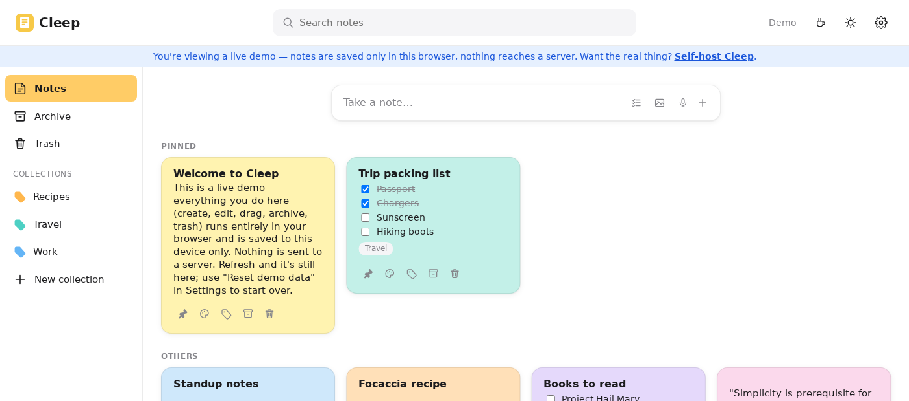
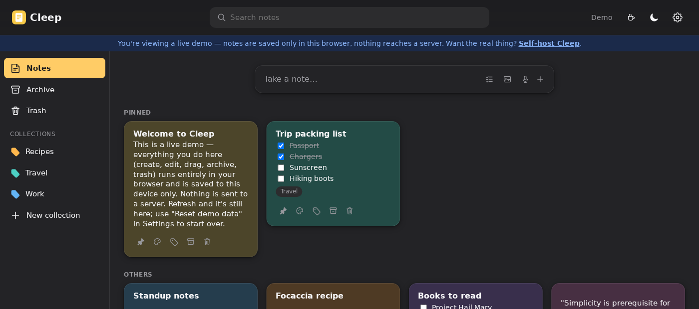
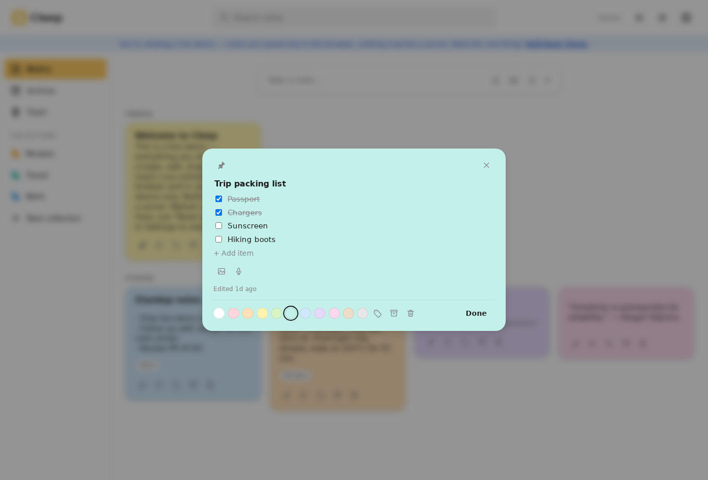

# Cleep

**A self-hosted, open-source Google Keep alternative.** Fast, colorful notes with checklists,
photo/video/audio attachments, and labels — running entirely on your own hardware, backed by your
own Postgres database.

[](#license)
[](https://github.com/blindpassasjer/cleep/pkgs/container/cleep)
[](package.json)

**[Try the live demo →](https://blindpassasjer.github.io/cleep/)** — a static build with a mocked,
browser-only backend (see [Demo mode](#demo-mode)) so you can click around without installing
anything.

No subscriptions, no ads, no third party reading your notes — just your data, on your server.

<p>
  
  
</p>
<p>
  
</p>

## Features

- 📝 **Notes & checklists** — pin, color, archive, trash (with undo everywhere it matters)
- 🖼️ **Attachments** — photos, videos, and audio recorded straight from the browser
- 🏷️ **Labels** for organizing notes into collections, plus multi-select bulk actions
- 🔍 **Search** across your whole library
- 👥 **Multi-user accounts** with session-based auth — everyone gets their own private notes
- 📱 **Installable as a PWA** — add it to your home screen and it works offline (needs HTTPS, see below)
- 🐳 **One `docker compose up`** — Postgres and the app, nothing else to configure

## Quick start (Docker Compose)

1. **Clone the repo and set up your environment file:**

   ```sh
   git clone https://github.com/blindpassasjer/cleep.git
   cd cleep
   cp .env.example .env
   ```

   Open `.env` and fill in:
   - `SESSION_SECRET` — generate one with `openssl rand -hex 32`
   - `POSTGRES_PASSWORD` and `DATABASE_URL` — keep the password in sync between the two
   - `ADMIN_EMAIL` / `ADMIN_PASSWORD` *(optional)* — bootstraps your first account on startup, so
     you can sign in immediately instead of building a registration flow

   Every variable is documented inline in [.env.example](.env.example), including `COOKIE_SECURE`
   and `TRUST_PROXY` for deployments behind a reverse proxy.

2. **Start it:**

   ```sh
   docker compose up -d
   ```

3. **Open `http://<host>:6169`** and sign in with the admin account you configured above.

That's it — Postgres migrations run automatically before the app starts.

### Where your data lives

Everything is stored in plain, host-visible folders instead of opaque Docker volumes, so you can
browse, back up, or move it like any other files:

| What | Where |
|---|---|
| Notes, users, labels (Postgres) | `./data/postgres` |
| Photos, videos, audio recordings | `./data/attachments/<user-id>/<note-id>/<file>` |

### Publishing your own image

The `docker-publish.yml` GitHub Actions workflow builds and pushes
`ghcr.io/blindpassasjer/cleep` on every push to `main`. GHCR packages default to **private** on
their first publish, even in a public repo — after the first workflow run, open the package
settings on GitHub and set its visibility to public so `docker compose pull` works without
authentication.

## Demo mode

The [live demo](https://blindpassasjer.github.io/cleep/) is a static build deployed to GitHub
Pages by [`.github/workflows/deploy-demo.yml`](.github/workflows/deploy-demo.yml) on every push to
`main`. GitHub Pages can only serve static files, so the demo build swaps the real Express/Postgres
API (`src/api/client.ts`) for a mock (`src/api/mockClient.ts`) that runs entirely in the browser:
notes and labels are saved to `localStorage` on your own device, attachments live only in memory
for the session, and there's no real login, multi-user, or admin behavior. Nothing is sent to a
server. Use "Reset demo data" in Settings to start over.

Build it yourself with:

```sh
VITE_DEMO=true npm run build
```

## PWA and HTTPS

Cleep is installable as a Progressive Web App — an "Install"/"Add to Home Screen" prompt, its own
window, and an offline app shell. This, like microphone access for audio recordings, only works
over a **secure context** (HTTPS, or `localhost`). Browsers won't register a service worker at all
on a plain `http://<nas-ip>:6169` origin, so with the default setup above neither installability
nor offline support will be available — the app itself still works fine either way.

To unlock both, put a reverse proxy with a TLS certificate in front of Cleep — Caddy, Traefik,
Nginx Proxy Manager, or your NAS's built-in one all work well. Once you do, also set
`TRUST_PROXY=true` in `.env` — otherwise every request looks to the app like it's coming from the
proxy's own IP, which shares the login rate limiter across all visitors and can trip a
"Too many requests" error after perfectly normal use.

## Local development

```sh
npm install
npm run server:dev   # API server on :6169
npm run dev           # Vite dev server on :5173, proxies /api to :6169
```

Point `DATABASE_URL` at a local Postgres instance, set `SESSION_SECRET` and `ATTACHMENTS_DIR` (any
local folder for uploaded files), then run `npm run db:migrate` before starting the server.

## Tech stack

React 18 · Express · PostgreSQL · Drizzle ORM · TypeScript · Vite — no framework lock-in, no
managed cloud service required, just a small, readable codebase you can actually audit.

## Contributing

Issues and pull requests are welcome — this is a small enough codebase that most changes are
straightforward to review.

## License

[Apache-2.0](LICENSE)
